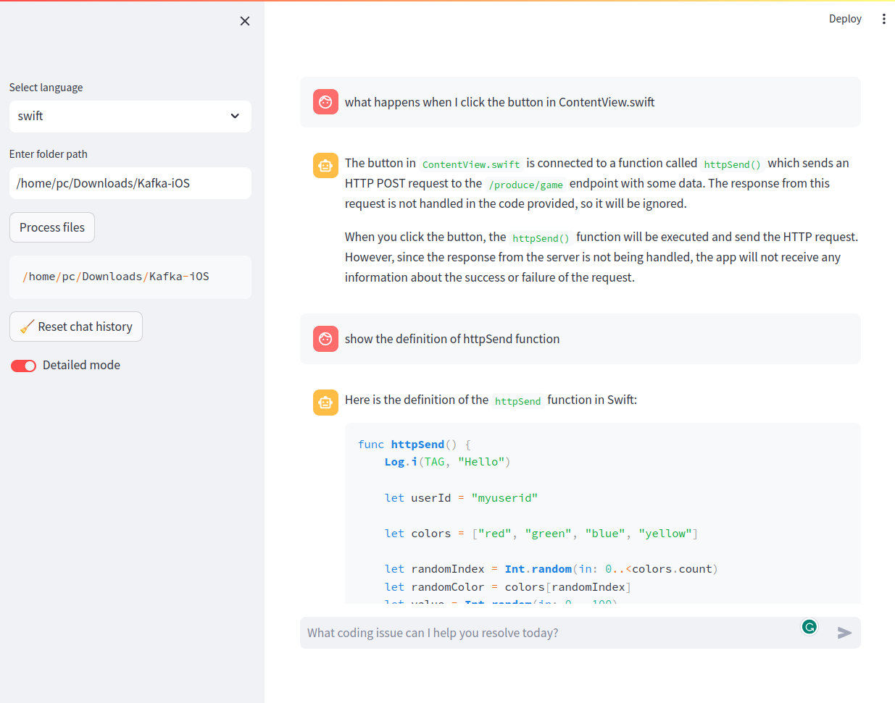

# Code Explorer

This app allows you to ask questions and get answers regarding your code provided the folder location of your code. It is a RAG LLM chain. The app was based on the GenAI stack from https://github.com/docker/genai-stack.



# Configure

Create a `.env` file from the environment template file `.example.env`

Available variables:
| Variable Name | Default value | Description |
|------------------------|------------------------------------|-------------------------------------------------------------------------|
| OLLAMA_BASE_URL | http://host.docker.internal:11434 | REQUIRED - URL to Ollama LLM API |  
| NEO4J_URI | neo4j://database:7687 | REQUIRED - URL to Neo4j database |
| NEO4J_USERNAME | neo4j | REQUIRED - Username for Neo4j database |
| NEO4J_PASSWORD | password | REQUIRED - Password for Neo4j database |
| LLM | codellama:7b-instruct | REQUIRED - Can be any Ollama model tag, or gpt-4 or gpt-3.5 or claudev2 |
| EMBEDDING_MODEL | ollama | REQUIRED - Can be sentence_transformer, openai, aws or ollama |
| AWS_ACCESS_KEY_ID | | REQUIRED - Only if LLM=claudev2 or embedding_model=aws |
| AWS_SECRET_ACCESS_KEY | | REQUIRED - Only if LLM=claudev2 or embedding_model=aws |
| AWS_DEFAULT_REGION | | REQUIRED - Only if LLM=claudev2 or embedding_model=aws |
| OPENAI_API_KEY | | REQUIRED - Only if LLM=gpt-4 or LLM=gpt-3.5 or embedding_model=openai |
| LANGCHAIN_ENDPOINT | "https://api.smith.langchain.com" | OPTIONAL - URL to Langchain Smith API |
| LANGCHAIN_TRACING_V2 | false | OPTIONAL - Enable Langchain tracing v2 |
| LANGCHAIN_PROJECT | | OPTIONAL - Langchain project name |
| LANGCHAIN_API_KEY | | OPTIONAL - Langchain API key |

NOTE: If using `EMBEDDING_MODEL=sentence_transformer`, uncomment code in `requirements.txt` & `chains.py`. It was commented out to reduce code size.

NOTE: Make sure to set the `OLLAMA_BASE_URL=http://llm:11434` in the `.env` file when using Ollama docker container.

# Docker (Linux only)

**Build only**

```
docker compose --profile linux build
```

**To start everything (Linux)**

```
docker compose --profile linux up --build
```

To enter **watch mode** (auto rebuild on file changes).
First start everything, then in new terminal:

```
docker compose --profile linux alpha watch
```

**Shutdown**
If health check fails or containers don't start up as expected, shutdown
completely to start up again.

```
docker compose --profile linux down
```

# Application

Access the app at http://localhost:8501. In the sidebar, enter the path to your code folder and click "Process files". Then start asking questions about your code in the main chat. The detailed mode toggle switches between asking the QA agent only (detailedMode=true) and asking an agent which uses the QA agent as a tool (detailedMode=false). In testing, the agent appears to summarize rather than giving a technical response as opposed to the QA agent only.

The Neo4j vector database can be explored at http://localhost:7474.
